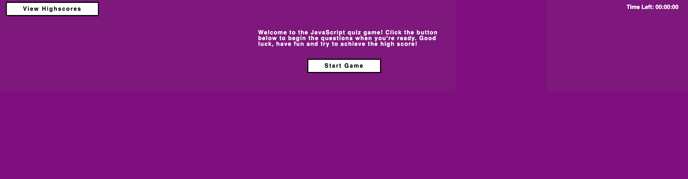

## Name
Coding Quiz Game created for Challenge 04 of the Web APIs module completed through Coding Bootcamp

## Description
Coding Quiz Game that takes players through a series of 10 questions surrounding JavaScript and its fundamentals.

## Visuals

## Usage
Open your browser and visit the Direct URL that has been provided below. Once on the webpage, click the 'Start Game' button when ready and the game will start with the initial question. Time limit is 2 minutes (Correct answers in increase time, Incorrect answers will decrease time). Once completed, you can enter your initials for the High Score. These will be displayed on the High Scores page and ranked based on score achieved.

Direct URL: https://elitehuskie.github.io/module-04-coding-quiz-game/

## License
Using standard MIT license